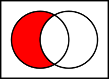
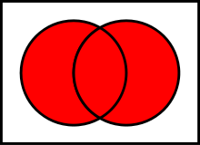
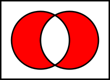

In this post I will do algorithmization of the array operations and describe the operations.

Summary:

* I. Intersection of sets
* II. Différence of sets
* III. Union of sets
* IV. Symmetric difference of sets
* conclusion

<!-- cut -->

## I. Intersection of sets

The intersection of two sets A and B is such a sets that contains all elements of A that also belong to B (or
equivalently, all elements of B that also belong to A), but no other elements.


The time complexity of its calculation is `O(m*n)`, where `m` and `n` are the lengths of A and B sets.

```js
function intersection(A, B)
{
    var m = A.length, n = B.length, c = 0, C = [];
    for (var i = 0; i < m; i++)
    { 
        var j = 0, k = 0;
        while (B[j] !== A[ i ] && j < n) j++;
        while (C[k] !== A[ i ] && k < c) k++;
        if (j != n && k == c) C[c++] = A[ i ];
    }
    return C;
}
```

For example,

```
intersection ([1,2,3,7,9],[4,5,7,2,1,5]); // Output: [1,2,7]
```

## II. Complement of sets

A complement of B in A is a set which contains all the elements of A which does not belong to B.



The time complexity is `O(m*n)`, where `m` and `n` are the lengths of the operated sets.

```js
function diff(A, B)
{
    var M = A.length, N = B.length, c = 0, C = [];
    for (var i = 0; i < M; i++)
    {
        var j = 0, k = 0;
        while (B[j] !== A[ i ] && j < N) j++;
        while (C[k] !== A[ i ] && k < c) k++;
        if (j == N && k == c) C[c++] = A[ i ];
    }
    return C;
}
```

For example,

```
diff([1,2,3,7,9],[4,5,7,2,1,5]); // Output [3,9]
diff([4,5,7,2,1,5], [1,2,3,7,9]); // Output [4,5]
```

## III. Union of sets

The union of two sets A and B is the set of elements which are in A, in B, or in both A and B.



The time complexity is `O(m*n)`, where `m` and `n` are the lengths of A and B sets.

```js
function sum(A, B)
{
    var M = A.length, N = B.length, count = 0, C = [];
    C = A;
    count = M;
    var cnt = 0;
    for (var i=0;i<N;i++)
    { 
        var plus = false;
        for (var j=0;j<M;j++)
            if (C[j] == B[i]) {plus = true; break;}
        if (plus === false) C[count++] = B[i];
    }
    return C;
}
```

For example,

```
sum([1,2,3,7,9],[4,5,7,2,1,5]); // Output [1,2,3,7,9,4,5]
sum([4,5,7,2,1,5],[1,2,3,7,9]); // Output [4,5,7,2,1,5,3,9]
```

## IV. Symmetric difference of sets

The symmetric difference of two sets is the set of elements which are in either of the sets and not in their
intersection.



The time complexity is `O(2m*n)`, where `m` and `n` are the lengths of operated sets.

In fact, this is complement of arrays, first `A \ B` and then `B \ A`.

```js
function symmetricDiff(A,B)
{
    var M = A.length, N = B.length, c = 0, C = [];
    for (var i = 0; i < M; i++)
    {
        var j = 0, k = 0;
        while (B[j] !== A[ i ] && j < N) j++;
        while (C[k] !== A[ i ] && k < c) k++;
        if (j == N && k == c) C[c++] = A[ i ];
    }
    for (var i = 0; i < N; i++)
    {
        var j = 0, k = 0;
        while (A[j] !== B[ i ] && j < M) j++;
        while (C[k] !== B[ i ] && k < c) k++;
        if (j == M && k == c) C[c++] = B[ i ];
    }
    return C;
}
```

For example,

```
symmetricDiff([1,2,3,7,9],[4,5,7,2,1,5]);// Output: [3,9,4,5]
symmetricDiff([1,2,3,4,5],[3,4,5,6,7]); // Output: [1,2,6,7]
```

## Conclusion

In practise this can be used, for example, to calculate which followers 2 users share in a social network.
